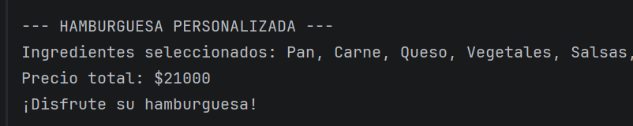

# DOSW_LAB2_BogotaSeguraVelez
In this proyect, Kevin Segura, Juan Daniel Bogotá and Juan Pablo Vélez will solve the laboratory #2 of the DOSW class

##  Reto #2: El Chef de 5 Estrellas

### 👥 Integrantes del grupo
- **Kevin Segura**
- **Juan David Vélez**
- **Juan Bogotá**

---

##  Descripción del reto
En este reto se implementó un sistema que permite la creación de hamburguesas personalizadas según la elección del cliente. Cada hamburguesa puede incluir ingredientes opcionales como pan, carne, queso, vegetales y salsas. El usuario selecciona los ingredientes a través de un menú interactivo en consola, y el chef se encarga de construir la hamburguesa final mostrando el detalle completo y su precio total.

---

## Patrón de Diseño

###  Categoría del patrón
**Patrones Creacionales**

###  Patrón utilizado
**Builder**

###  Justificación
Se utilizó el patrón Builder debido a que la hamburguesa es un objeto complejo que puede construirse de múltiples formas, ya que no todos los ingredientes son obligatorios. Este patrón permite crear la hamburguesa paso a paso, agregando únicamente los ingredientes seleccionados por el usuario, lo que mejora la legibilidad del código y facilita su mantenimiento.

###  Cómo se aplicó
Se implementó la clase `Hamburguesa` como el producto final y la clase `HamburguesaBuilder` como el encargado de construir la hamburguesa. A través de un menú interactivo, el usuario selecciona los ingredientes que desea y cada selección se añade al builder. Finalmente, el chef genera la hamburguesa utilizando el método `build()`, y el precio total se calcula haciendo uso de Streams.

---

##  Ejecución del reto
La ejecución del reto se realiza desde la clase `Application`, la cual contiene el método `main`. 
Desde allí se invoca el método `ejecutar()` de la clase `Reto2`, que se encarga de manejar la interacción con el usuario, 
la construcción de la hamburguesa y la visualización del resultado final en consola.

### Evidencias

