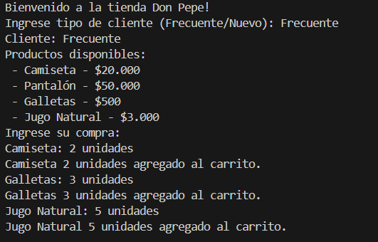
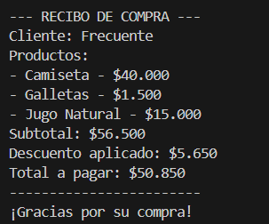
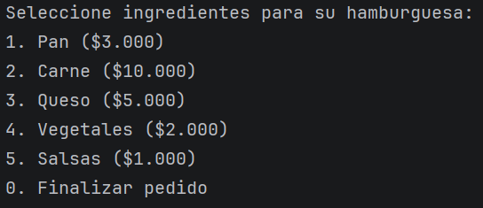

# DOSW_LAB2_BogotaSeguraVelez
In this proyect, Kevin Segura, Juan Daniel Bogotá and Juan Pablo Vélez will solve the laboratory #2 of the DOSW class

##  Reto #1: Tienda Don Pepe

### 👥 Integrantes del grupo
- **Kevin Segura**
- **Juan Pablo Vélez**
- **Juan Bogotá**

---

##  Descripción del reto
Este proyecto implementa un sistema simple de compras para la tienda Don Pepe, donde: ingresa productos y cantidades al carrito de compras, el usuario recibe el descuento según el tipo de cliente (Frecuente o Nuevo), obtiene un recibo al final.

El sistema fue desarrollado aplicando el patrón de diseño creacional Factory Method.

## ¿Cómo se aplica SOLID?

En el reto se aplican los principios SOLID así: S ya que cada clase tiene una única responsabilidad, por ejemplo, el carrito de compras maneja solo la funcion de tener los productos "adentro", la clase DonPepeFactory crea los productos, O porque es posible agregar nuevos productos solo extendiendo la fabrica, I por la interfaz ProductFactory y D porque el sistema depende de la abstracción ProductFactory y no directamente de su implementación concreta, lo que reduce el acoplamiento y mejora la flexibilidad del diseño.

## ¿Cómo se aplica SOLID?

El polimorfismo en la solución se aplica al trabajar con el método create de la interfaz ProductFactory ya que en este caso solo estamos ofreciendo productos, pero si Don Pepe desea ofrecer servicios puede otra clase usar ese mismo metodo pero de forma diferente.

## Patrón de Diseño

###  Categoría del patrón
**Patrones Creacionales**

###  Patrón utilizado
**Factory Method**

###  Justificación
Se utilizó el patrón Factory Method debido a que el sistema necesita crear distintos objetos Producto sin que la clase principal (Reto1) conozca los detalles de su instanciación. En lugar de usar new directamente en la lógica principal, la creación de productos se delega a una fábrica, lo que reduce el acoplamiento, centraliza la lógica de creación y facilita la incorporación de nuevos productos sin modificar el flujo del programa.

###  Cómo se aplicó
Se definió la interfaz ProductFactory con el método create(String productName), y se implementó en la clase DonPepeProductFactory, que se encarga de crear los objetos Producto según el nombre ingresado por el usuario. En la clase Reto1, se trabaja con la abstracción ProductFactory y se invoca el método create() para obtener los productos, sin depender directamente de su implementación concreta, aplicando así el patrón creacional de manera clara y estructurada.

---

##  Ejecución del reto
La ejecución del reto se realiza desde la clase `Application`, la cual contiene el método `main`. 
Desde allí se invoca el método `ejecutar()` de la clase `Reto1`, que se encarga de manejar la interacción con el usuario.

### Evidencias

##  Reto #2: El Chef de 5 Estrellas

### 👥 Integrantes del grupo
- **Kevin Segura**
- **Juan Pablo Vélez**
- **Juan Bogotá**

---

##  Descripción del reto
En este reto se implementó un sistema que permite la creación de hamburguesas personalizadas según la elección del cliente. Cada hamburguesa puede incluir ingredientes opcionales como pan, carne, queso, vegetales y salsas. El usuario selecciona los ingredientes a través de un menú interactivo en consola, y el chef se encarga de construir la hamburguesa final mostrando el detalle completo y su precio total.

---

## Patrón de Diseño

###  Categoría del patrón
**Patrones Creacionales**

###  Patrón utilizado
**Builder**

###  Justificación
Se utilizó el patrón Builder debido a que la hamburguesa es un objeto complejo que puede construirse de múltiples formas, ya que no todos los ingredientes son obligatorios. Este patrón permite crear la hamburguesa paso a paso, agregando únicamente los ingredientes seleccionados por el usuario, lo que mejora la legibilidad del código y facilita su mantenimiento.

###  Cómo se aplicó
Se implementó la clase `Hamburguesa` como el producto final y la clase `HamburguesaBuilder` como el encargado de construir la hamburguesa. A través de un menú interactivo, el usuario selecciona los ingredientes que desea y cada selección se añade al builder. Finalmente, el chef genera la hamburguesa utilizando el método `build()`, y el precio total se calcula haciendo uso de Streams.

---

##  Ejecución del reto
La ejecución del reto se realiza desde la clase `Application`, la cual contiene el método `main`. 
Desde allí se invoca el método `ejecutar()` de la clase `Reto2`, que se encarga de manejar la interacción con el usuario, 
la construcción de la hamburguesa y la visualización del resultado final en consola.

### Evidencias

